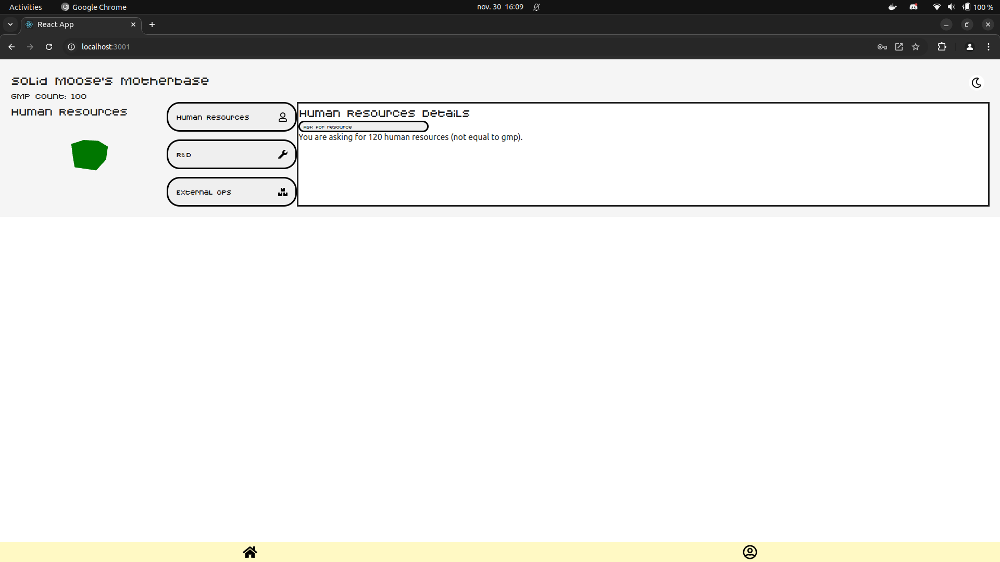

## mgs-motherbase-pwa

This repository is a MyDigitalSchool project intervening in the context of a mobile/react development course where learning how to use react on an atomic level is the objective

(meaning we utilize the atoms/molecules/organisms/templates way of managing components, [read more about Atomic design patern here](https://medium.com/@janelle.wg/atomic-design-pattern-how-to-structure-your-react-application-2bb4d9ca5f97)).

The project in itself aims to propose a UX in the world of Metal Gear Solid, allowing you as a user to manage your own MotherBase, heavy inspirations coming from MGS: PeaceWalker

## how to launch

**_required :_**

- nodeJs >= 20

Clone the repository and follow the next steps
Be sure to fill your own .env !

```
npm install
```

```
npm run start
```

open the link in your browser (usually localhost:3000 but since the back-api also uses :3000 you will be prompted to use 3001)

## how to launch the back-end

this repository contains the front-end of the application, to successfully use the online features, make sure you have cloned and launched the [mgs-recruit-api](https://github.com/Guigzouz/mgs-recruit-api) follow the repo's own readme to successfully launch it

## the experience in itself



Based on Metal Gear Solid: PW mother base management "mini-game" you will **as of now** be able to make a secured account with your own immutable codename and you will also be able to recruit human resources to strengthen your motherbase differents fields of action while overall managing you gmp count.

## what comes next ?

As of now the project is at a very basic level, and the gmp_count is yet just a redux countSlice that increases your score (much like an idle game), but the purpose is not to make an idle game but rather a management game worldwide, here below a list of features that i plan on doing next

- Overall scoreboard of users gmp count
- "External Ops" that will allow two users's motherbase to "fight" and gain/loose resources
- "R&D" -> for better overall technology (multplicator of strength for a unit)
- Recruits details -> In-depth customization of each unit & randomly generated images of them

## used stack

- ThreeJS (spinning model of MotherBase)
- Redux (Persisting state of user's score)
- React-router-dom
